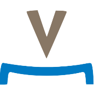

# OpenPrevo

An **open** [**prévo**yance professionnelle](https://www.bsv.admin.ch/bsv/en/home/social-insurance/bv/grundlagen-und-gesetze/grundlagen/sinn-und-zweck.html) platform supporting the [second pillar of the Swiss retirement provision](https://www.ch.ch/en/manage-retirement-provision/).

## Introduction [Slides](https://gitpitch.com/open-prevo/slides/intro)

## [Getting Started](doc/gettingStarted.md)

### Switching Employments

#### The problem

(new employment),(new employment)->|a|,|a|->(notify old employer)->(notify old RF)->(contact person),|a|->(notify new employer)->(notify new RF)->(contact person)->(notify old RF)-><c>[is valid]->(send money and document)->(end),<c>[invalid]->(notify old RF).svg"/>

#### The idea

(new employment),(new employment)->|a|,|a|->(notify old employer)->(notify old RF)->(use OpenPrevo),|a|->(notify new employer)->(notify new RF)->(use OpenPrevo)-><c>[new RF found]->(notify RFs, send money and document)->(end),<c>[no result]->(notify old RF).svg"/>

## [Architecture](https://open-prevo.github.io/openprevo/)

## [Glossary](https://open-prevo.github.io/openprevo/#section-glossary)

## [About](doc/about.md)
