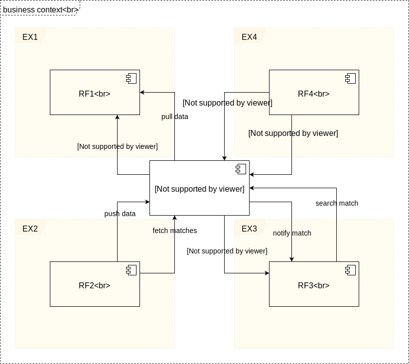
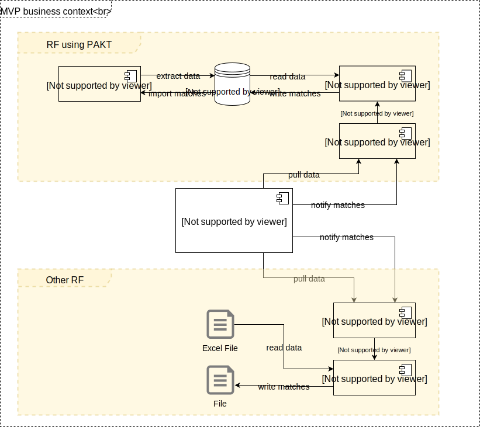

[[section-system-scope-and-context]]
== System Scope and Context

[role="arc42help"]
****

.Contents
System scope and context - as the name suggests - delimits your system (i.e. your scope) from all its communication partners
(neighboring systems and users, i.e. the context of your system). It thereby specifies the external interfaces.

If necessary, differentiate the business context (domain specific inputs and outputs) from the technical context (channels, protocols, hardware).

.Motivation
The domain interfaces and technical interfaces to communication partners are among your system's most critical aspects. Make sure that you completely understand them.

.Form
Various options:

* Context diagrams
* Lists of communication partners and their interfaces.
****

=== Business Context

==== General Overview

The following graphic depicts 4 different examples how different RFs could potentially interact with our platform (OpenPrevo Hub).

The following table explains the graphic above in more detail. All the different interfaces used for the communication between the different systems, would be
pre-defined REST interfaces. Therefore a RF can implement their system independent of any programming language / framework. Every time the platform informs a RF about a match, it would send the payment information to the RF so that they have all information needed to transfer the money.

[options="header", cols="1,4"]
.OpenPrevo Business Context
|===
| System | Description
| OpenPrevo Hub | The Hub knows all different RFs which are registered on the platform and it is aware of their matching strategies. It is responsible for the matching.
| EX1 / RF1 | The first and most likely the default strategy would be, that the RF provides the data of people leaving or entering this RF. The platform fetches
the data in regular intervals and matches it. The RF will be informed about the matches. Every match must be notified only once.
| EX2 / RF2 | If the RF does not want to provide an interface, it can also push the data into the platform and the platform stores the data. The platform still
performs regularly its matching. The RF can consume the current matches via an API.
| EX3 / RF3 | Another strategy would be that the RF itself does the matching. Therefore the platform would ask the RF for matches during the execution of the matching. On the other hand the RF can also ask the platform for matches, e.g. when a new person enters into their system. Also here the platform would notify
the RF if there is a match and provide the payment information. The goal of this strategy would be that the data never leaves the RF.
| EX4 / RF4 | There might be even the case that a RF wants to manually enter the data on the platform. This would most likely be a web application. The application would also display all matches for the entered data.
|===

To limit the information that will be exchanged between the different RFs and the platform, every RF needs to provide a unique identifier (UID) for each person. In the case of a match the platform would then only inform the RF that we found a match for a certain UID and how the money needs to be transferred to the new RF.

==== MVP Business Context

To limit the scope for the MVP, we decided to implement the following solution. There will be only one of the above mentioned strategies (EX1/RF1), but we'll provide two different implementations. One of the implementation would integrate with the PAKT system and on the other hand we'll provide a simple implementation which could potentially be used by a small RF.

[options="header", cols="1,4"]
.OpenPrevo Business Context
|===
| System | Description
| OpenPrevo Hub | The Hub fetches the data of the different RFs and is responsible for the matching.
| PAKT | "Personen Applikation Kollektiv" which is used by different RFs to manage their customers. The TOE / COE will be extracted from the system and stored in a database that can be consumed by the OpenPrevo Client.
| OpenPrevo Node | An implementation of the API that can be consumed by the OpenPrevo Hub. The node should be able to consume different data storages like e.g. a database or an Excel file.
|Excel File| Could be a simple data exchange format for a small RF, if they're not able to provide an integration into their system.
|===

=== Technical Context

[role="arc42help"]
****
.Contents
Technical interfaces (channels and transmission media) linking your system to its environment. In addition a mapping of domain specific input/output to the channels, i.e. an explanation with I/O uses which channel.

.Motivation
Many stakeholders make architectural decision based on the technical interfaces between the system and its context. Especially infrastructure or hardware designers decide these technical interfaces.

.Form
E.g. UML deployment diagram describing channels to neighboring systems,
together with a mapping table showing the relationships between channels and input/output.

****

**<Diagram or Table>**

**<optionally: Explanation of technical interfaces>**

**<Mapping Input/Output to Channels>**
