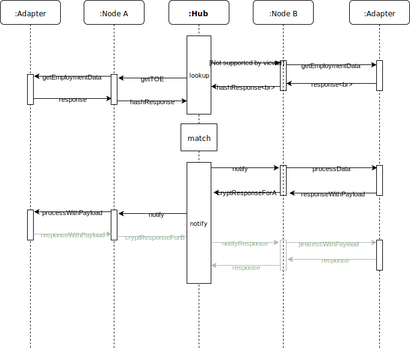

[[section-runtime-view]]
== Runtime View

[role="arc42help"]
****
.Contents
The runtime view describes concrete behavior and interactions of the system’s building blocks in form of scenarios from the following areas:

* important use cases or features: how do building blocks execute them?
* interactions at critical external interfaces: how do building blocks cooperate with users and neighboring systems?
* operation and administration: launch, start-up, stop
* error and exception scenarios

Remark: The main criterion for the choice of possible scenarios (sequences, workflows) is their *architectural relevance*. It is *not* important to describe a large number of scenarios. You should rather document a representative selection.

.Motivation
You should understand how (instances of) building blocks of your system perform their employment and communicate at runtime.
You will mainly capture scenarios in your documentation to communicate your architecture to stakeholders that are less willing or able to read and understand the static models (building block view, deployment view).

.Form
There are many notations for describing scenarios, e.g.

* numbered list of steps (in natural language)
* activity diagrams or flow charts
* sequence diagrams
* BPMN or EPCs (event process chains)
* state machines
* ...

****

=== Hub

==== main loop: data lookup, matching and notification

- **Node A**: has a matching termination
- **Node B**: has a matching commencement

. Step: **lookup** data at nodes (in parallel)
* ask nodes for commencement of employment(s)
* ask nodes for termination of employment(s)
. Step: wait for response(s)
. Step: find **match**(es) in response(s)
. Step: **notify** about match(es)
.. notify node B with matching commencement (passing the public key from node A with termination) and ask for payload
.. notify node A with matching termination (and encrypted payload from B)
.. **optional** (in grey)
... response from A to B
... pass the public key on notify from node B to A
... pass encrypted response from A to B

=== <Runtime Scenario 2>

=== ...

=== <Runtime Scenario n>
